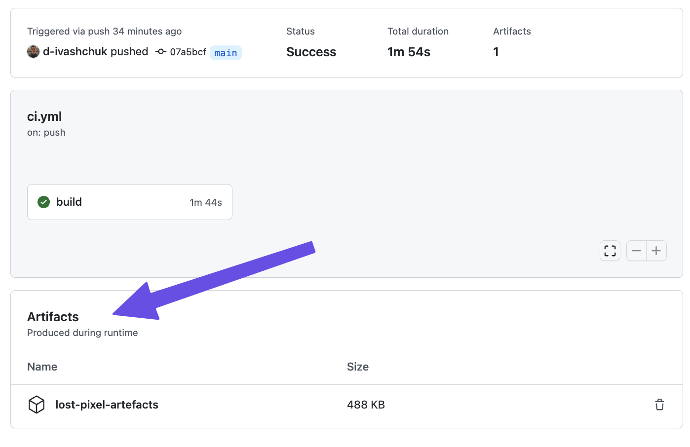

# Access test run images

When using the **Open Source Edition** of Lost Pixel, you might want to look at your failed tests that were [happening on CI](../community-edition/getting-started.md). While Lost Pixel provides extensive logging, you would not be able to see the images in the output of the action by default.\
\
To access the generated images you would need to use GitHub Actions Artefacts. Extend [the bare-bone GitHub Action Lost Pixel setup](../setup/integrating-with-github-actions.md) with the following step:

```
...

  - uses: actions/upload-artifact@v3
    with:
      name: lost-pixel-artefacts
      path: .lostpixel
```

This step will ensure that everything that will be generated during the Lost Pixel action run on CI will be accessible for the download later after the workflow is finished:


