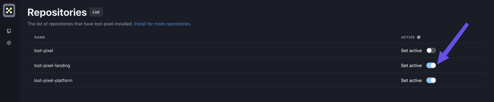
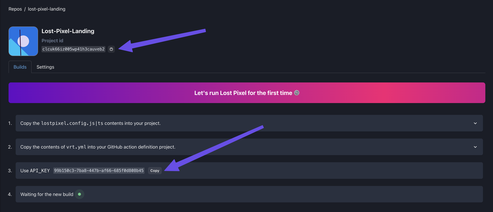
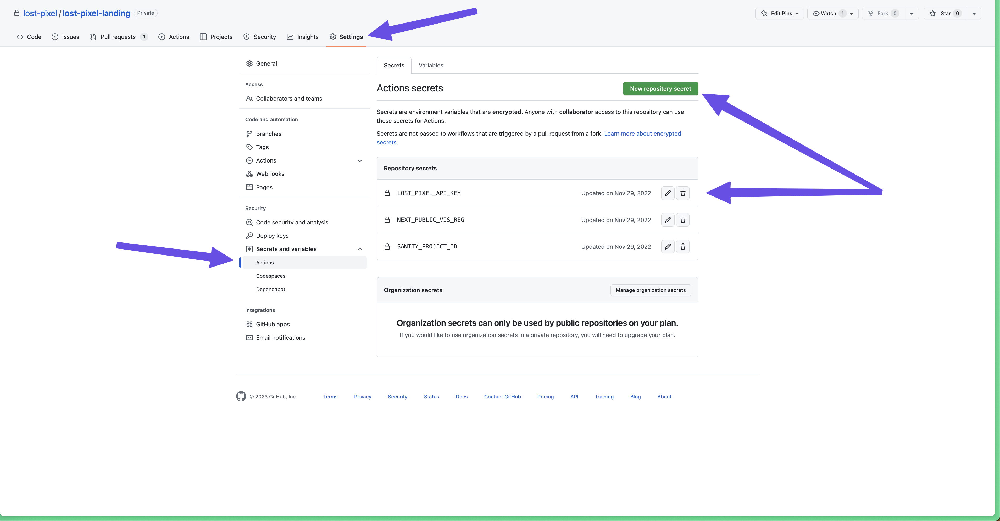

# ⏯ Lost Pixel Platform

[Lost Pixel Platform](https://lost-pixel.com) offers a managed service with a user-friendly interface for a more efficient visual regression testing workflow.

The platform version provides additional features like collaboration tools, automated test runs, and detailed reporting. Upgrading to the Lost Pixel Platform allows you to streamline your visual regression testing process, improve collaboration with your team, and gain access to valuable insights and analytics.

Lost Pixel Platform has first-class integration with **GitHub** & **GitHub Actions** but can be set up with any CI provider, **`given it runs on GitHub`**


Storybook + Lost Pixel Platform



Ladle + Lost Pixel Platform



Playwright + Lost Pixel Platform


### Create Lost Pixel related files

We need to create `lostpixel.config.js|ts` file that will run the whole setup. We will use the example of [lost-pixel.com](https://www.lost-pixel.com) as it is set up on our own platform 😊



```typescript
import { CustomProjectConfig } from 'lost-pixel';

export const config: CustomProjectConfig = {
  pageShots: {
    pages: [
      { path: '/', name: 'landing' },
      {
        path: '/blog',
        name: 'blog',
      },
    ],
    baseUrl: 'http://172.17.0.1:3000',
  },
  lostPixelProjectId: 'we_will_paste_id_here_later',
  apiKey: process.env.LOST_PIXEL_API_KEY,
};
```



Next up is the GitHub action declaration file that lives in `.github/workflows`. We are building & serving our Next.js application & run Lost Pixel on it's pages(defined in the above file):



```yaml
on: [push, pull_request]

jobs:
  build:
    runs-on: ubuntu-latest
    name: Lost Pixel

    steps:
      - name: Checkout
        uses: actions/checkout@v2

      - name: Setup Node
        uses: actions/setup-node@v3
        with:
          node-version: 16.x

      - name: Instal pnpm
        uses: pnpm/action-setup@v2
        with:
          version: 7.17.1

      - name: Install dependencies
        run: pnpm install

      - name: Build next
        run: pnpm run build

      - name: Start next
        run: pnpm run start &

      - name: Lost Pixel
        uses: lost-pixel/lost-pixel@v3.21.0
        env:
          LOST_PIXEL_API_KEY: ${{ secrets.LOST_PIXEL_API_KEY }}
```



### Set up the Lost Pixel platform

Visit the [Lost Pixel installation page](https://github.com/apps/lost-pixel/installations/new) and install Lost Pixel App on organisations & repositories you want to have visual tests on

<figure><figcaption></figcaption></figure>

Sign in using **GitHub** into [app.lost-pixel.com](https://app.lost-pixel.com), switch to the correct organisation & select which repositories selected in the previous step should be visible on the Lost Pixel Platform:

<figure><figcaption><p>app.lost-pixel.com/app/repos/manage</p></figcaption></figure>

From the onboarding-screen copy your **`project id`** and replace it in the `lostpixel.config.ts` created in the first step

```
lostPixelProjectId: 'clcuk66iz005wp41h3cauveb2',
```

Copy the **Lost Pixel API key**, we will need to do the final step to provide it as a GitHub Action secret.&#x20;

<figure><figcaption><p>app.lost-pixel.com/app/repos/lost-pixel-landing </p></figcaption></figure>

### Set Lost Pixel API key on GitHub

<figure><figcaption><p>Setting LOST_PIXEL_API_KEY as Action Secret</p></figcaption></figure>

### Your visual regression testing workflow is done 🎊

All new pushes to your repository are triggering visual tests that you can conveniently manage yourself or collaboratively with your team!

<figure><figcaption><p>lost-pixel.com visual test managed on Lost Pixel Platform</p></figcaption></figure>
